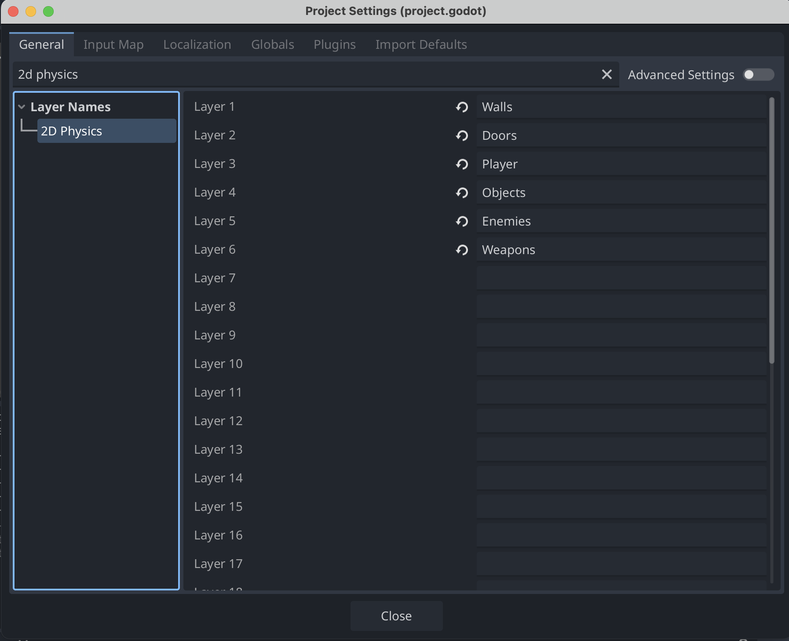

# Tilføj Collision Layers

For at kunne styre forskellige slags collisions, skal vi bruge collision layers.

1. Gå ind i Godot
2. Find menupunktet `Project` øverst på skærmen og klik på det
3. Klik på `Project Settings`
4. Skriv `2d physics` i søgefeltet og vælg `2D Physics` under Layer Names
5. Tilføj disse layers:
   - Layer 1: Walls
   - Layer 2: Doors
   - Layer 3: Players
   - Layer 4: Objects
   - Layer 5: Enemies
   - Layer 6: Weapons

Det skal se sådan her ud, når du er færdig:

