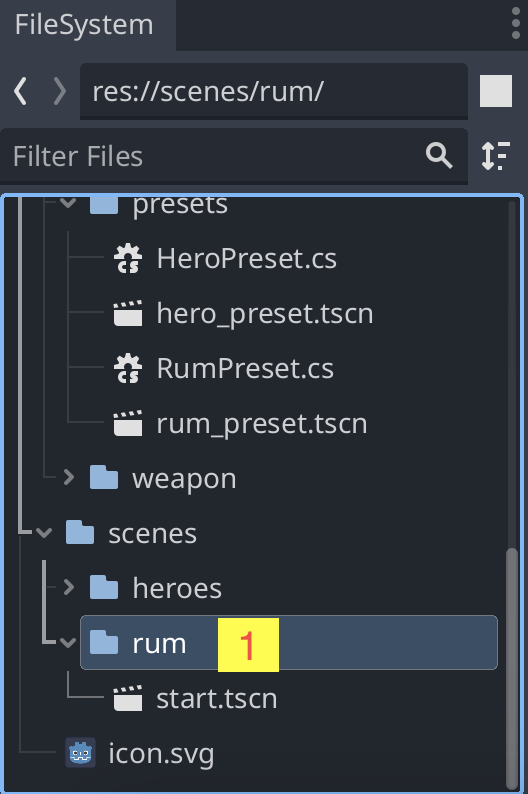
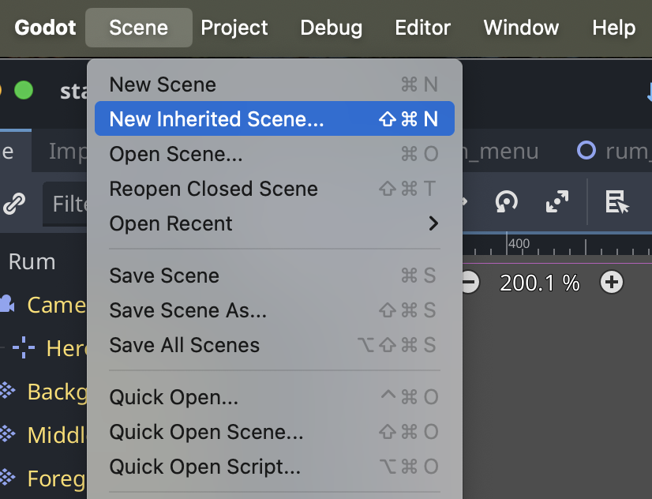
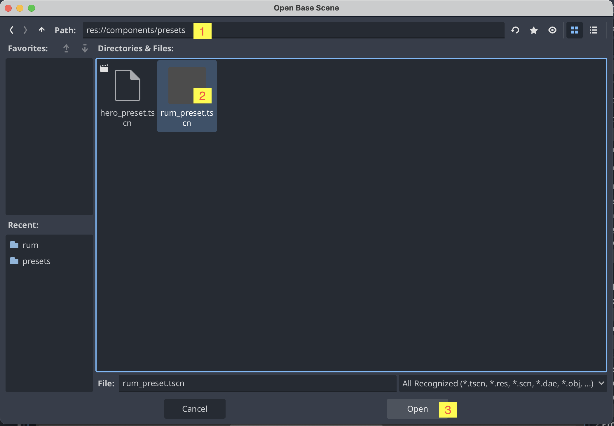
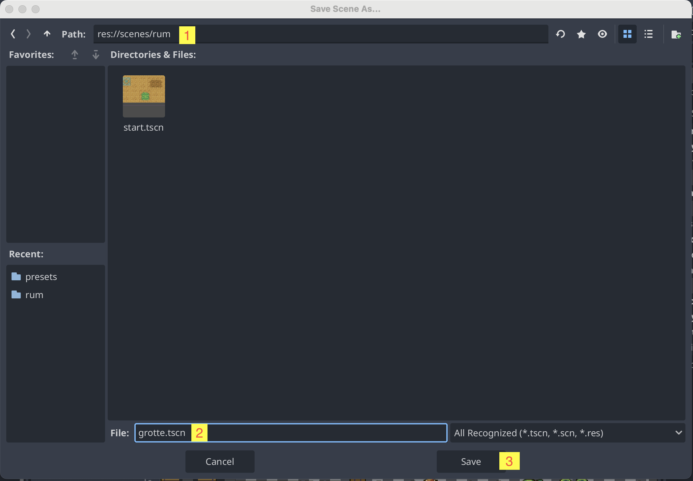

# Tilføj et nyt rum

For at lave et nyt rum, som din spiller kan udforske, skal du gøre sådan her:

1. Klik på mappen `scenes/rum` neders til venstre

2. Klik derefter på `Scene` i menuen øverst og vælg `New Inherited Scene`

3. Gør nu følgende 3 ting:
   - Skift til `preset`-mappen ved at skrive `res://components/presets` i stien øverst
   - Klik på `rum_presets.tscn`
   - Klik på `Open`

4. Gem dit nye rum det rigtige sted
   - Klik `Ctrl+S` eller `Cmd+S` for at gemme
   - Skift til `scenes/rum`-mappen ved at skrive `res://scenes/rum` i stien øverst
   - Giv dit nye rum et navn
   - Klik `Save`

Nu har du et nyt rum, som du kan opbygge som du har lyst. Du kan tilføje flere rum ved at gentage processen.