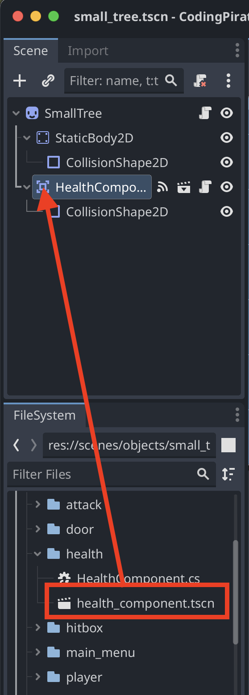
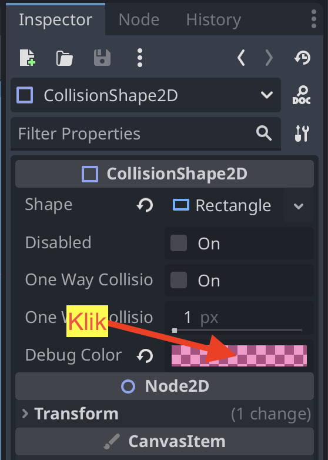
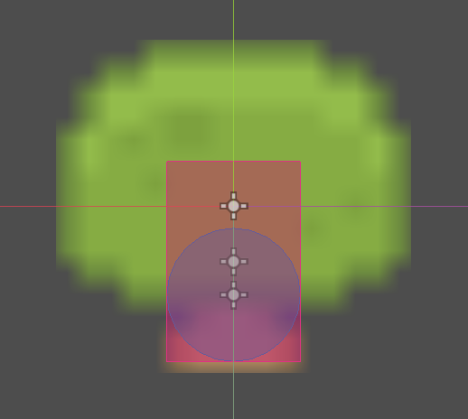
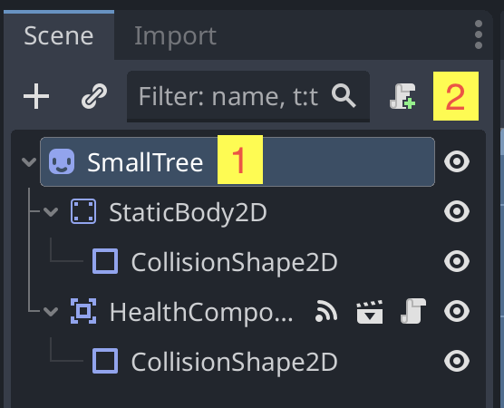
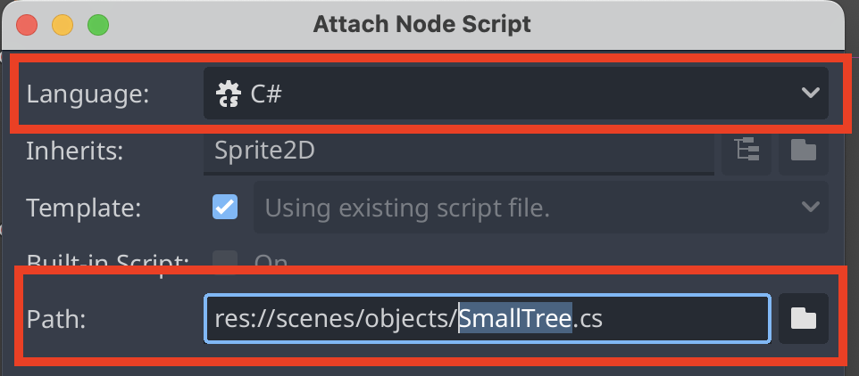
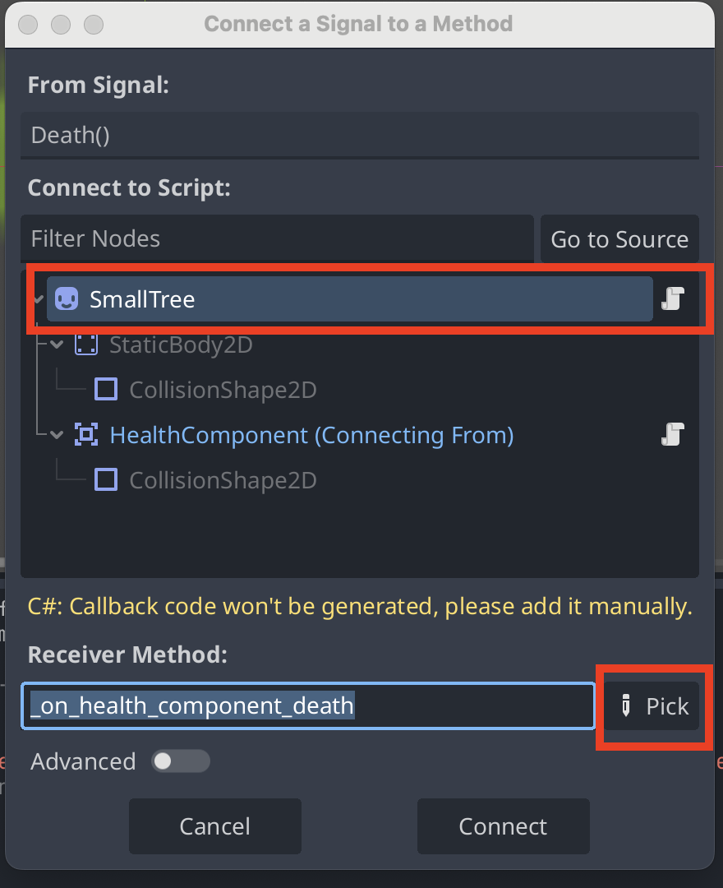
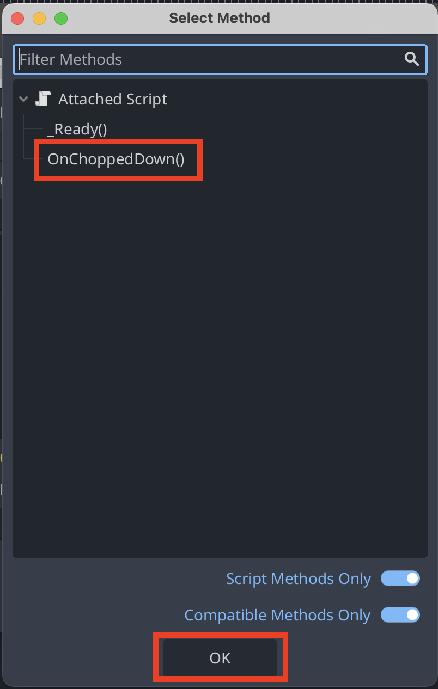
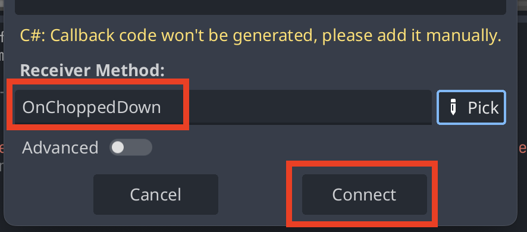

# Angrib et `Object`

Nu skal vi kombinere to ting vi lavede tidligere:

- Vi har animationen, der får spilleren til at angribe
- Vi har `Object`-komponenten

Det er `Object`-komponenten, der nu skal reagere på at blive angrebet. I første omgang får vi bare objektet til at forsvinde, når det ikke har mere `Health`(liv).

## Sådan gør du

1. Find din `Object`-scene og åben den.
2. Fra `health`-mappen under `components` trækker du `health_component.tscn` ind.



3. Tilføj en `CollisionShape2D` til `HealthComponent` (ligesom i billedet ovenfor)
4. Skift farven på `CollisionShape2D` til rød, så vi kan kende forskel på den og den anden `CollisionShape2D`



5. Tilpas `CollisionShape2D` til at dække det område du vil have din spiller skal kunne ramme med sit angreb. Fx sådan her:



Den blå cirkel er den vi lavede tidligere, som gør at spilleren ikke kan gå igennem træet. Den røde firkant er den jeg vil have spilleren skal kunne ramme med sit angreb.

6. Tilføj et script til dit `Object`





7. Kopier koden herunder ind i dit script:

```csharp
using Godot;
using System;

public partial class SmallTree : Sprite2D
{
    // Called when the node enters the scene tree for the first time.
    public override void _Ready()
    {
    }
    
    // Called every frame. 'delta' is the elapsed time since the previous frame.
    public override void _Process(double delta)
    {
    }
    
    public void OnChoppedDown()
    {
        QueueFree();
    }
}

```

8. Tilbage i Godot klikker du på `HealthComponent` i venstre side og derefter på `Node` i højre side.
9. Dobbeltklik på `Death()` og connect det til `OnChoppedDown`

Vælg først den rigtige Node og klik derefter på `Pick`:



Klik derefter på `OnChoppedDown()` og så på `OK`:



Klik på `Connect`:



10. Vælg igen `HealthComponent` i venstre side og klik på `Inspector` i højre side.
11. Skriv `20` i `Health`
12. Start spillet og prøv nu at angribe dit `Object`.