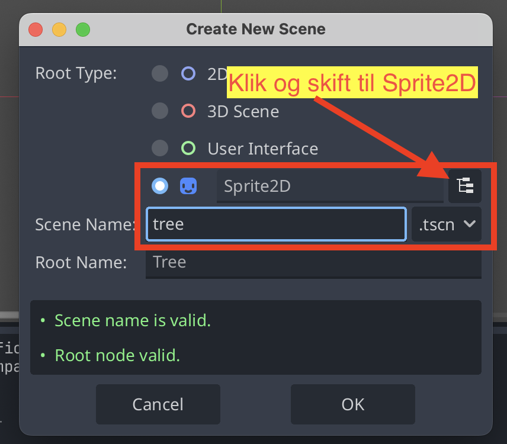
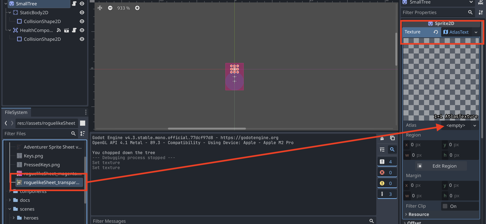
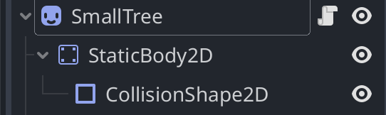
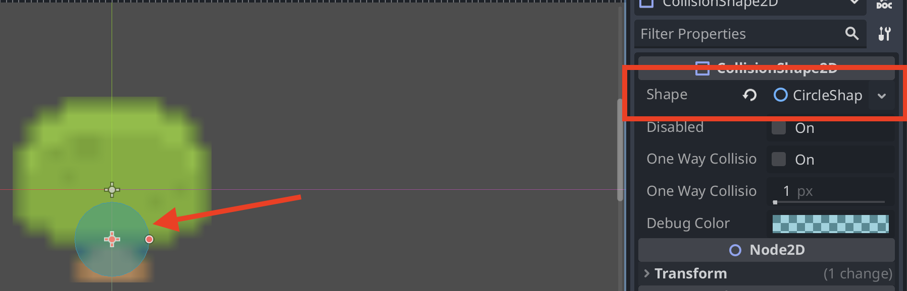

# Lav et object

Et `Object` kan fx være et træ, en kiste, en sten eller hvad som helst andet du kan finde på.

> Et `Object` er noget, som spilleren kan _gøre_ noget med. Man kan fælde et træ, åbne en kiste eller samle noget op. Et `Object` er altså **ikke** en del af baggrunden.

For at lave et object skal du gøre følgende ting (beskrevet i detaljer længere nede):

- Lave en ny scene
- Give scenen et billede (Sprite2D)
- Give scenen en CollisionShape2D

## 1. Lav scenen

Den nemmeste måde at lave et `Object` på, er at lave det som en Sprite2D.

- Find din egen mappe i `scenes`-mappen neders til venstre i Godot
- Højreklik på den og lav en ny mappe inden i, som hedder `objects`
- Højreklik på den nye mappe og vælg `Create new` og vælg `scene`
  - Scenen skal være af typen `Sprite2D`
  - Vælg et navn, der passer til den type scene du vil lave

Det skal se sådan her ud:

## 2. Giv scenen et billede

Der er forskellige måder at give scenen et billede på. Man kan:

- Vælg et billede fra assets-mappen. Det kan fx være du har designet dit eget pixel-billede på [PixilArt](https://www.pixilart.com/draw)
- Vælge en del af ens tilemap

### Brug et billede fra assets-mappen

Hvis du har et billede i assets-mappen du kan bruge, skal du finde det og trække det over på `Texture` for din `Sprite2D`.

### Brug dit TileMap

Hvis du vil bruge dit tilemap, skal du gøre sådan her:

1. Klik på `Texture` under `Inspector` og vælg `New Atlas Texture`
2. Find dit tilemap i assets-mappen og træk det ind i `Atlas`

3. Klik på tilmappet i `Atlas` hvor du lige har trukket det ind
4. Klik på `Edit Region`
5. Sørg for at `Pixel snap` er valgt
6. Find den del af tilmappet du vil bruge, og marker det
7. Klik på `Close`

Her er en video, der viser, hvordan det virker. I skal se cirka 20 sekunder af videoen:

[Video](https://youtu.be/it0lsREGdmc?si=EciGS1_zfyFK6z8S&t=5550)

> I videoen bruger han `Grid snap`. Prøv jer frem med, hvad der virker bedst for jer, men start med `Pixel snap`

## 3. Lav en static body og en collision shape

1. Tilføj en `StaticBody2D` under jeres `Sprite2D`
2. Tilføj en `CollisionShape2D` under `StaticBody2D`
3. Tilføj en shape til jeres `CollisionShape2D` og tilpas den
   - Jeres collision shape er den del, som spilleren ikke kan gå igennem

