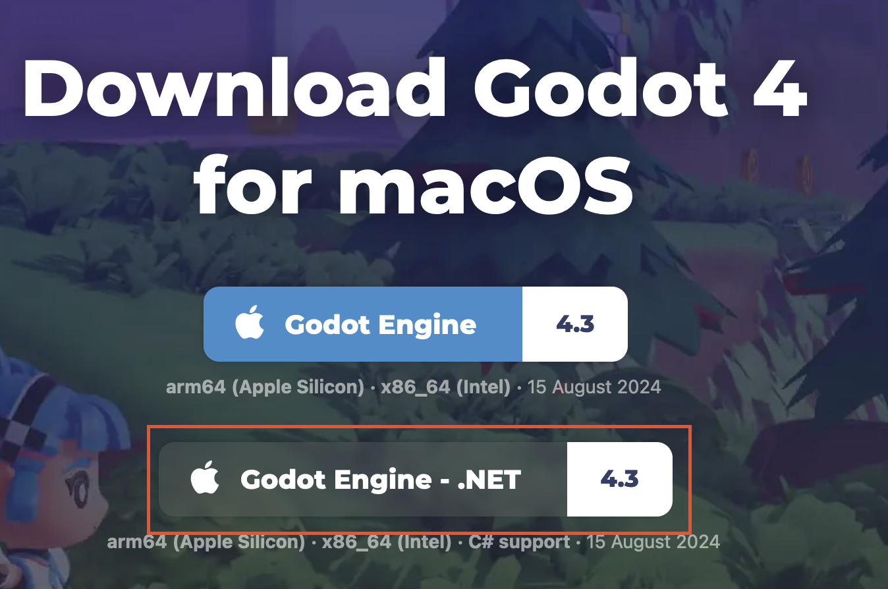

# Installation

## Godot

Gå til https://godotengine.org/download/ og download Godot version 4.3 til .NET.

## .NET

Download .NET 8 fra https://dotnet.microsoft.com/en-us/download/dotnet/8.0

Spørg din lærer hvilken version du skal vælge.

## IDE

Du skal bruge et program du kan kode i. Du skal vælge en af følgende:

- [Jetbrains Rider](https://www.jetbrains.com/rider/download)
- [Visual Studio Community Edition](https://visualstudio.microsoft.com/downloads/)
- [Visual Studio Code](https://code.visualstudio.com/download)

Alle tre findes i en gratis version. Hvis din computer ikke er så kraftig, er Visual Studio Code det bedste valg.