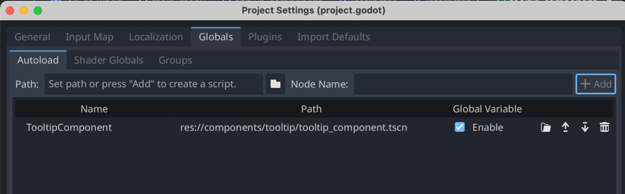

# Interact

Når vi skal lave interaktioner i vores spil, fx samle ting op eller åbne en dør eller kiste, skal vi bruge to nye komponenter.

## Kopier komponenter

Start med at kopiere de fire filer som ligger i `components/interact` ind i din `components`-mappe. Det er de to scener og de to scripts.

Kopier derefter de to filer som ligger i `components/tooltip` ind i din `components`-mappe. Det er en scene og et script.

## Preload Tooltip

For at forbedre performance i vores spil, skal vi lave det der hedder et `preload`. Et preload betyder, at vi loader en scene ind i hukommelsen, så den er klar til at blive brugt, når vi skal bruge den. Det gør at vi ikke skal vente på at Godot loader scenen, når vi skal bruge den.

1. Åben `Project Settings` i Godot
2. Gå til fanen `Globals`
3. Klik på det hvide mappe-ikon og find din `tooltip_component.tscn`-scene
4. Klik på `+ Add`

Det skal se sådan her ud når du er færdig:

## Gør din hero til en interactor

1. Find din `hero`-scene i Godot
2. Træk din `interactor_component` ind i din `hero`-scene
3. Tilføj en `CollisionShape2D` til din `interactor_component` i hero-scenen

## Gør en scene til en interactable

1. Find den scene du vil lave interaktion med
2. Træk din `interactable_component` ind i din scene
3. Tilføj en `CollisionShape2D` til din `interactable_component` i din scene
4. Gå til `Node` i højre side (du skal have valgt `Interactable` i venstre side)
5. Forbind `OnInteract` med en metode i din scenes script, som gør det du gerne vil