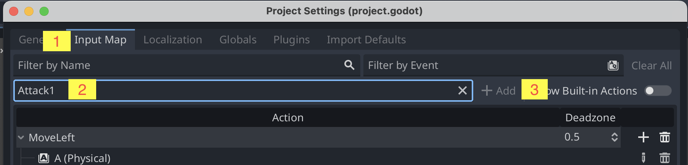
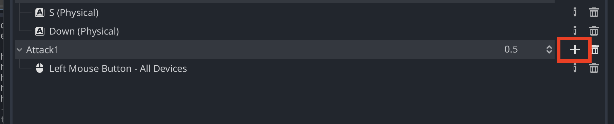
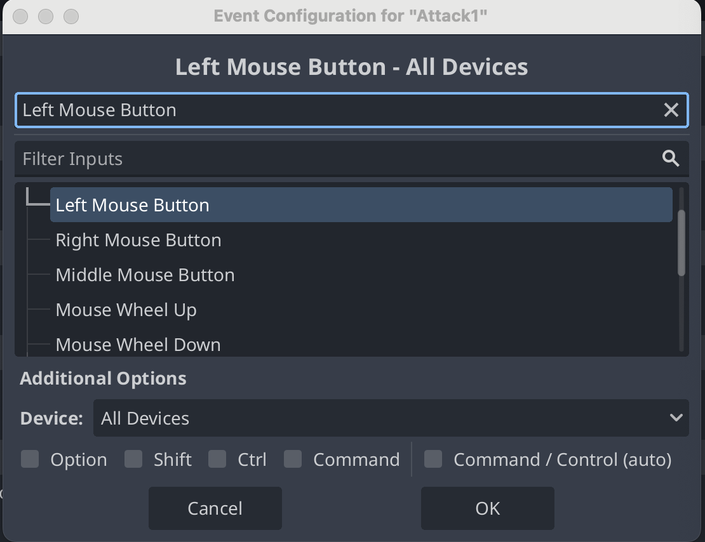

# Angrib

Din spiller kan allerede angribe. Angreb vil vi bruge til fx at fælde træer, angribe fjender eller hugge sten.

For at få angrebsanimationen til at virke skal du:

1. Gå ind i Godot
2. Find menupunktet `Project` øverst på skærmen og klik på det
3. Klik på `Project Settings`
4. Skift til `Input Map` øverst
5. I feltet `Add New Action` skriver du `Attack1`
6. Tryk `+ Add`

7. Klik på `+` ud for `Attack1`

8. Klik i feltet, hvor der står `Listening for input`
   - Nu ser du teksten skifte til `Left Mouse Button`
   - Det skal se sådan her ud

9. Klik på `OK` og derefter på `Close`

Start spillet. Når du går rund med din spiller kan han nu angribe, hvis du klikker med musen.