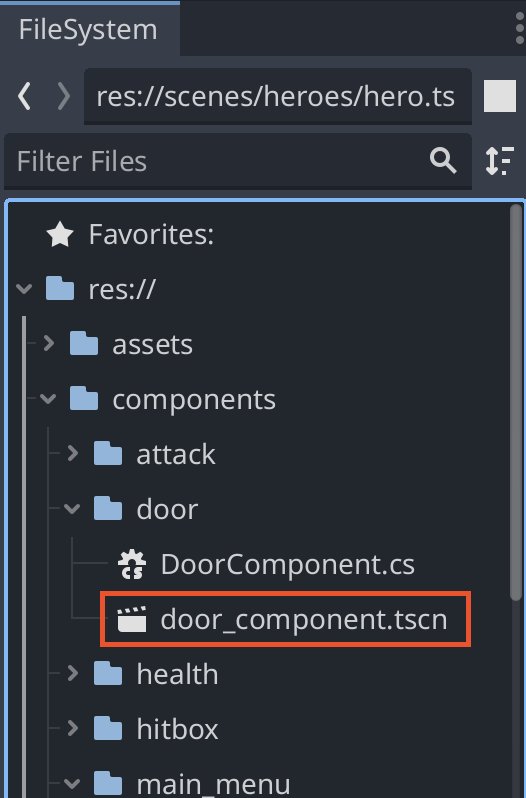
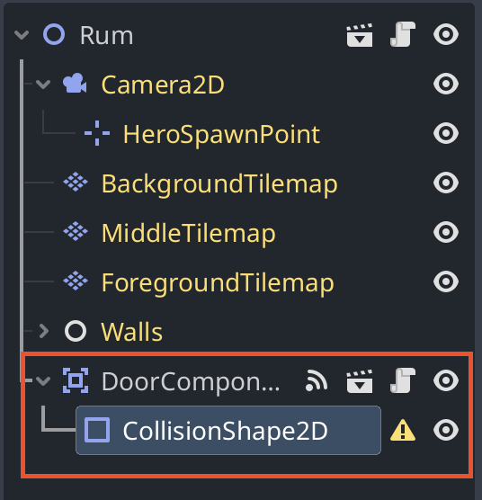
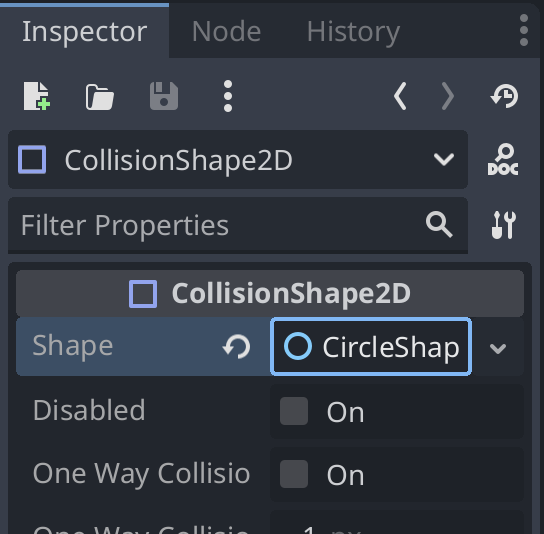
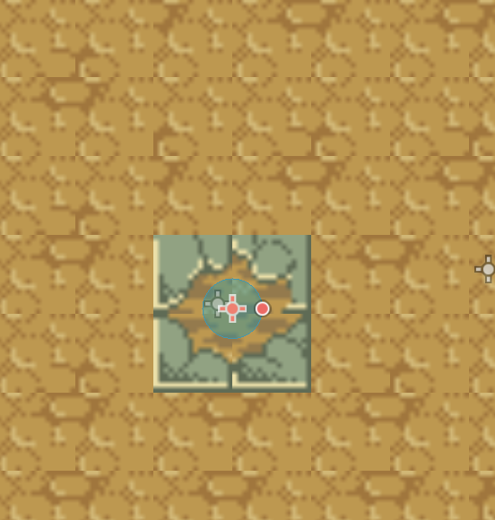
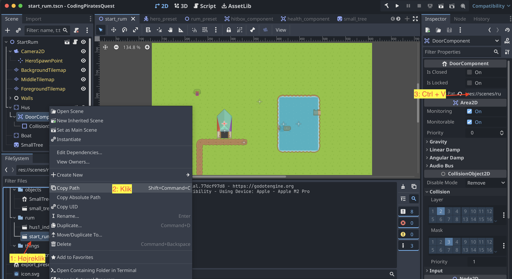

# Skift rum

Når du skal skifte fra ét rum til et andet, skal du gøre følgende:

1. Åben den scene du gerne vil skifte fra
2. Træk `door_component.tscn` ind i scenen

3. Klik på DoorComponent i venstre side af Godot og tilføj en CollisionShape2D

4. Vælg `CollisionShape2D` og klik på `Shape` i højre side af Godot. Vælg den shape, der passer til din dør
5. Tilpas din shape til der hvor spilleren skal skifte rum. Her har jeg valgt en cirkel, fordi min spiller skal falde ned i grotten, hvis ham rammer hullet

6. Vælg igen DoorComponent i venstre side af Godot og klik på `Inspector` i højre side.
7. Skriv path til den scene du vil skifte til i feltet `Leads To Path`
   - Du får den rigtige path ved at **højreklikke** på den scene du vil skifte til og klikke på `Copy Path`
   - Sæt den derefter ind i feltet med `Ctrl + V` (eller `Cmd + V` på Mac)

Nu vil din spiller skifte rum, når han rammer døren.