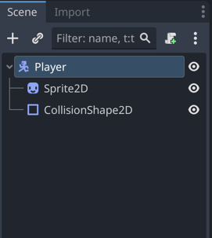
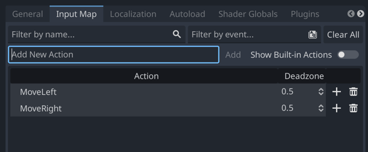
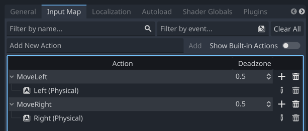
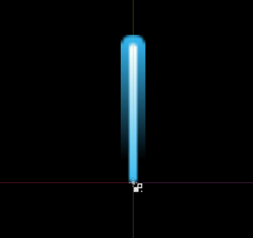
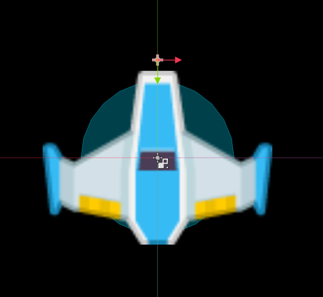
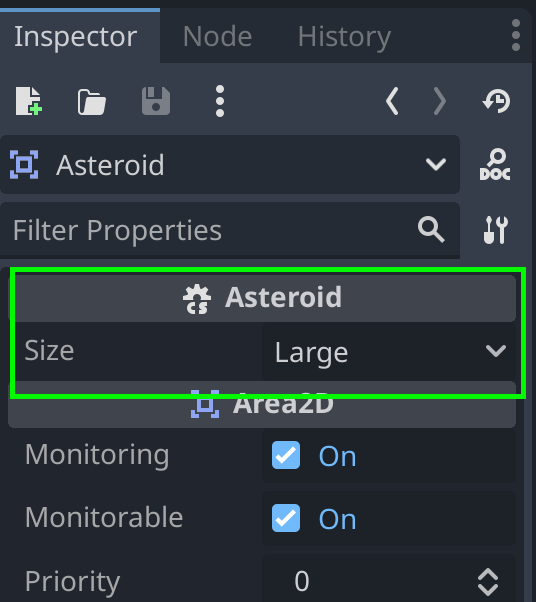
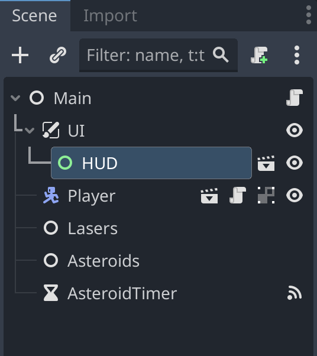

# Coding Pirates Galten-Skovby Forår 2024

Vi koder spil med Godot game engine.

<details>
    <summary>Installation</summary>

1. Gå til [godot download](https://godotengine.org/download) og vælg `Godot Engine - .NET`

> :warning: **Vigtigt:** Det skal være .NET versionen, da vi skal bruge C#.

2. Gå til [.NET 8 download](https://dotnet.microsoft.com/en-us/download/dotnet/8.0) og vælg vælg den rigtige download under `sdk`. Underviserne hjælper jer med at finde den rigtige.

</details>

## Arkanoid

Det første vi skal lave er en simpel udgave af spillet [Arkanoid](https://en.wikipedia.org/wiki/Arkanoid), også kendt som breakout-game.

<details>
    <summary>1. Opret projektet</summary>

1. Åben Godot og vælg `+ New`. 
2. I `Project Name` skriver du `Arkanoid`.
3. Klik på `Browse` og vælg en mappe, hvor du vil gemme alle de spil vi skal lave og klik så `Select Current Folder`.
4. Klik på `Create Folder` og klik så på `Create & Edit`.
5. Klik på `Editor -> Editor Settings` i toppen af skærmen. Scroll ned i bunden af venstre side og klik på `Dotnet -> Editor` og under `External Editor` vælger du den editor du vil bruge til at skrive kode.
</details>

<details>
    <summary>2. Opret en main scene</summary>

Alt i Godot foregår i scener. En scene er en samling af objekter, som kan være alt fra en baggrund til en spiller. Vi skal bruge en scene, som vi kan bruge som vores hovedscene. Det er herfra vi starter spillet.

Skift først til `2D` mode i toppen af skærmen. Følg derefter disse trin:

1. Klik på `:heavy_plus_sign: Other Node` i venstre side.
2. Vælg den øverste mulighed, som bare hedder `Node` og klik Create.
3. Dobbeltklik på `Node` i venstre side og skriv `Main` i stedet.
4. Klik på `Project -> Project Settings` i toppen af skærmen og vælg `Window`.
5. Sæt `Viewport Width` til `2000` og `Viewport Height` til `1000` og klik `Close`.
6. Gem projektet ved at trykke `Ctrl + S` eller `Command + S`. Klik `Save` for at gemme vores `main.tscn`scene.

</details>

<details>
    <summary>3. Importer sprites</summary>

Vi skal bruge noget simpelt grafik til vores spil.

1. Åben mappen [sprites](Arkanoid/sprites) og download de fire `*.png`-filer derfra.
2. I Godot nederst til venstre højreklik på `res://` og vælg `New Folder`. Skriv `sprites` og tryk `Enter`.
3. Træk de downloaded filer ind i `sprites`-mappen i Godot.

</details>

<details>
    <summary>4. Tilføj vægge</summary>

For at vores bold skal kunne blive på skærmen, skal vi lave nogle vægge som den kan ramme.

1. Tilføj en ny scene (find selv ud af hvordan). Den skal være af typen `StaticBody2D`.
2. Til venstre omdøber du dine nye scene til `Wall`.
3. Under `Wall` tilføjer du nu en `Sprite2D` og en `CollisionShape2D`.
4. For din `Sprite2D` finder du `Texture` og trækker `wall.png` ind.
5. For din `CollisionShape2D` finder du `Shape` og vælger `RectangleShape2D`.
6. Nu tilpasser du størrelsen af din `CollisionShape2D` til at passe med din `Sprite2D`.
7. Vælg igen `Wall` til venstre og tryke `Ctrl + G` eller `Command + G`. Dette grupperer dine objekter og sørger for at du ikke kommer til at flytte din collision shape, men altid flytter hele scenen.
8. Skift nu tilbage til din `main`-scene og tilføj en `Wall`-scen. Få den til at fylde hele den ene side af din main scene. Forsøg selv at finde ud af hvordan.
9. Gentag processen og lav en væg i den anden side samt et tag i toppen af skærmen.

</details>

<details>
    <summary>5. Tilføj en bold</summary>

1. Tilføj en ny scene. Den skal være af typen `CharacterBody2D`. Giv den navnet `Ball`.
2. Tilføj en `Sprite2D` og en `CollisionShape2D` til din `Ball`.
3. For din `Sprite2D` finder du `Texture` og trækker `ball.png` ind.
4. For din `CollisionShape2D` finder du `Shape` og vælger `CircleShape2D`.
5. Nu tilpasser du størrelsen af din `CollisionShape2D` til at passe med din `Sprite2D`.
6. Gå tilbage til din `main`-scene og tilføj en `Ball`-scene. Placer den i midten a skærmen, lidt til venstre og giv den en passende størrelse.

</details>

<details>
    <summary>6. Tilføj en spiller</summary>

1. Tilføj en ny scene. Den skal være af typen `CharacterBody2D`. Giv den navnet `Player`.
2. Tilføj en `Sprite2D` og en `CollisionShape2D` til din `Player`.
3. For din `Sprite2D` finder du `Texture` og trækker `player.png` ind.
4. For din `CollisionShape2D` finder du `Shape` og vælger `RectangleShape2D`.
5. Nu tilpasser du størrelsen af din `CollisionShape2D` til at passe med din `Sprite2D`.
6. Gå tilbage til din `main`-scene og tilføj en `Player`-scene. Placer den i bunden af skærmen, cirka i midten og giv den en passende størrelse.

</details>

<details>
    <summary>7. Få bolden til at bevæge sig</summary>

1. Gå tilbage til din `Ball`-scene og klik på `Attach script`-knappen i venstre side a skærmen (den har et grønt kryds).
2. Sæt `Language` til `C#` og `Path` til `res://Ball.cs` (:grey_exclamation: sørg for at det er med stort B).
3. Udskift indholdet i `Ball.cs` med følgende:

```csharp
using Godot;
using System;

public partial class Ball : CharacterBody2D
{
	// Her saetter vi hastigheden fra spillets start. Proev jer frem med hvilken vaerdi I vil have.
	public const float Speed = 300.0f;

    public override void _Ready()
    {
		// Velocity betyder retning og hastighed. 500, 500 er en god start, men proev jer frem.
        Velocity = new Vector2(500, 500);
    }

	// Koden i _PhysicsProcess koerer i et evigt loop og kan fx bruges til at flytte vores scene
	public override void _PhysicsProcess(double delta)
	{
		// MoveAndCollide er en indbygget Godot-metode, som vi kan bruge til at flytte vores scene i en retning.
		// Samtidig fortaeller den os om vi er stoedt ind i noget
        KinematicCollision2D collision = MoveAndCollide(Velocity * (float)delta);
		if (collision != null) 
		{
			// Hvis vi er stoedt ind i noget finder vi her den vinkel vi er stoedt ind i det med og udregner derefter
			// vores nye Velocity (retning og hastighed) ved at bruge en anden indbygget Godot-metode, nemlig Bounce()
			Vector2 reflect = collision.GetRemainder().Bounce(collision.GetNormal());
			Velocity = Velocity.Bounce(collision.GetNormal());

			// Til sidst begynder vi at flytte vores scene i den nye retning
			MoveAndCollide(reflect);
		}
    }

	public void OnScreenExited()
	{
		GetTree().ReloadCurrentScene();
	}
}

```

4. Gå tilbage til Godot og Klik på `Play`-knappen i toppen af skaermen. Nu skulle bolden gerne bevaege sig rundt på skærmen.

</details>

<details>
    <summary>8. Genstart spillet</summary>

Vi vil gerne genstarte spillet, når bolden ryger ud af bunden af skærmen.

1. Vælg `Ball`-scenen og tilføj et nyt child object af typen `VisibleOnScreenNotifier2D`.
2. Vælg `VisibleOnScreenNotifier2D` og klik så på `Node`-tabben i højre side af skærmen.
3. Find `screen_exited`, højreklik på den og klik `Connect`.
4. Klik på `Pick`-knappen og vælg `OnScreenExited()` og klik `Connect`. Koden til det har vi allerede sat ind tidligere.
5. Start spillet igen. Nu skulle du gerne se at spillet genstarter, når bolden ryger ud af bunden af skærmen.

</details>

<details>
    <summary>9. Få spilleren til at bevæge sig</summary>

Vi flytter spilleren frem og tilbage ved at bruge piletasterne.

1. Vælg `Player`-scenen og klik på øverste objekt i venstre side, som hedder `Player`. Det skal gerne ligne dette billede:



2. Klik på `Attach script`-knappen i venstre side af skærmen (den med det grønne kryds).
> :grey_exclamation: Kald scriptet `Player.cs` med stort P.
3. Gå til `Project -> Project Settings` i toppen af skærmen og vælg `Input Map`.
4. Tilføj to nye actions, en kaldet `MoveLeft` og en kaldet `MoveRight`. Se om du selv kan finde ud af hvordan. Når du har gjort det, skal det gerne se sådan her ud:



5. Nu skal du få `MoveLeft` til at lytte på venstre piletast og `MoveRight` til at lytte på højre piletast. Klik på `MoveLeft` og klik på `+ Add Event`. Vælg `Key` og tryk på venstre piletast. Gør det samme for `MoveRight` og højre piletast. Du skal bruge `+`-knappen ud for hver funktion.



6. Udskift indholdet i `Player.cs` med følgende:

```csharp
using Godot;
using System;

public partial class Player : CharacterBody2D
{
	// Acceleration betyder hvor hurtigt spilleren bevaeger sig
	public float Acceleration = 100;
	// Friction betyder hvor hurtigt spilleren stopper, naar man slipper tasten
	public float Friction = 100;

	public override void _PhysicsProcess(double delta)
	{
		if (Input.IsActionPressed("MoveLeft"))
		{
			Velocity = new Vector2(Velocity.X - Acceleration, Velocity.Y);
		}
		if (Input.IsActionPressed("MoveRight"))
		{
			Velocity = new Vector2(Velocity.X + Acceleration, Velocity.Y);
		}

		MoveAndSlide();
		Velocity = Velocity.MoveToward(Vector2.Zero, Friction);
	}
}
```
7. Start spillet og se at spilleren bevæger sig, når du trykker på piletasterne. Den bevæger sig bare ikke særlig optimalt.

</details>

<details>
    <summary>10. Få spilleren til at bevæge sig ordentligt</summary>

Spilleren kan bevæge sig nu, men det fungerer ikke særlig godt.

> **Opgave**: Åben `Player.cs` og se øverst i filen, hvor der er to variabler, som hedder `Acceleration` og `Friction`. Prøv at ændre på dem og start spillet igen. Hvad sker der? Find frem til to værdier, som du synes fungerer godt.

</details>

<details>
    <summary>11. Tilføj bricks</summary>

Bricks er de ting, som bolden skal ramme. Vi skal bruge en ny scene til dem.

1. Tilføj en ny scene. Den skal være af typen `StaticBody2D`. Giv den navnet `Brick`.
2. Tilføj en `Sprite2D` og en `CollisionShape2D` til din `Brick`.
3. For din `Sprite2D` finder du `Texture` og trækker `brick.png` ind.
4. For din `CollisionShape2D` finder du `Shape` og vælger `RectangleShape2D`. Sørg for at den passer med din `Sprite2D`.
5. Gå tilbage til din `main`-scene og tilføj en `Brick`-scene. Placer den et sted på skærmen og giv den en passende størrelse.
6. Start spillet og prøv at bolden rammer din brick.

</details>

<details>
    <summary>12. Få bolden til at ødelægge bricks</summary>

Bricks skal forsvinde når bolden rammer dem.

1. Gå tilbage til din `Ball`-scene og klik på `Attach script`-knappen i venstre side a skærmen (den har et grønt kryds).
2. Sæt `Language` til `C#` og `Path` til `res://Ball.cs` (:grey_exclamation: sørg for at det er med stort B).

Der skal kodes to ting for at få bolden til at ødelægge bricks:

1. Først skal vi lave en metode i vores `Brick.cs` script, som kan få den til at forsvinde fra skærmen.
2. Derefter skal vi kalde den metode fra vores `Ball.cs` script, når bolden rammer en brick.

Vi starter med at lave metoden i `Brick.cs`. Kopier følgende ind i `Brick.cs`:

```csharp
public void Hit() 
{
    QueueFree();
}
```

`QueueFree()` er en indbygget Godot-metode, som sørger for at fjerne objektet fra skærmen.

Vi har nu en metode kaldet `Hit()` som vi kan kalde fra vores `Ball.cs` script. Vi skal bare finde ud af hvornår bolden har ramt en brick.

Skift over til `Ball.cs` og find linjen, hvor der står `Velocity = Velocity.Bounce(collision.GetNormal());` 

Efter den linje skal du tilføje følgende:

```csharp
if (collision.GetCollider() is Brick brick)
{
    // her har du en variabel der hedder brick. Proev om du kan bruge den til at faa vores brick til at forsvinde
}
```

Nu skal du finde ud af hvordan du retter den kode til, så en brick forsvinder, når bolden rammer den.

</details>

<details>
    <summary>13. Tilføj flere bricks</summary>

Tilføj en masse bricks til din `main`-scene og start spillet. Se om du kan rydde skærmen for bricks.

</details>

## Asteroids

Nu skal vi lave en klon af det gamle spil [Asteroids](https://en.wikipedia.org/wiki/Asteroids_(video_game)).

<details>
    <summary>1. Opret projektet</summary>

1. Åben Godot og vælg `+ New`.
2. I `Project Name` skriver du `Asteroids`.
3. Klik på `Browse` og vælg den samme mappe som du valgte til Arkanoid og klik så `Select Current Folder`.
4. Klik på `Create Folder` og klik så på `Create & Edit`.

</details>

<details>
    <summary>2. Klargør projektet</summary>

1. Opret mapper. Nederst til venstre i Godot laver du denne struktur under `res://`:
```
res://
  - assets
    - sprites
    - audio
    - font
  - scenes
  - scripts
```
2. Download `*.png`-filer fra [sprites](Asteriods/assets/sprites) og `*.wav`-filer fra [audio](Asteriods/assets/audio) og læg dem i de rigtige mapper.

</details>

<details>
    <summary>3. Tilføj en main scene</summary>

1. Tilføj en ny scene. Den skal være af typen `Node`. Giv den navnet `Main`.
2. Tryk `Ctrl` + `S` eller `Command` + `S` for at gemme din scene. Sørg for at gemme den i `scenes`-mappen og kald den `main.tscn`.
3. Gå til `Project -> Project Settings` i toppen af skærmen og vælg `Environment` og sæt `Default Clear Color` til helt sort.
4. Start spillet og se hvor meget det fylder på din skærm. Gå til `Project -> Project Settings` igen og vælg `Window`. Prøv om du kan finde en `Viewport Width` og `Viewport Height` der passer godt til din skærm.

</details>

<details>
    <summary>4. Tilføj en spiller</summary>

Spilleren er vores rumskib, som vi kan styre rundt på skærmen. Vi har allerede lavet en spiller før, så prøv om du selv kan finde ud af at lave den. Åben `spoilers` hvis du skal have hjælp.

Lidt hjælp:

- `Player` skal være af typen `CharacterBody2D`.
- Husk at tilføje en `Sprite2D` og en `CollisionShape2D`.
- Husk at gemme din scene i `scenes`-mappen og kalde den `player.tscn`.
- Tilføj en `Player`-scene til din `Main`-scene og se om du kan finde ud af at ændre størrelsen så den passer til din skærm.

<details>
    <summary>spoilers</summary>

1. Tilføj en ny scene. Den skal være af typen `CharacterBody2D`. Giv den navnet `Player`.
2. Tilføj en `Sprite2D` og en `CollisionShape2D` til din `Player`.
3. For din `Sprite2D` finder du `Texture` og trækker `player.png` ind.
4. For din `CollisionShape2D` finder du `Shape` og vælger `CircleShape2D`.
5. Nu tilpasser du størrelsen af din `CollisionShape2D` til at passe med din `Sprite2D`.
6. Gå tilbage til din `main`-scene og tilføj en `Player`-scene. Placer den cirka i midten af skærmen.
7. Start spillet og se hvordan størrelsen på din spiller passer til skærmen.
8. Vælg igen din `Player`-scene og sørg for at vælge `Player`-objektet i venstre side af skærmen.
9. Vælg nu `Transform` i højre side af skærmen og sæt `Scale` til fx `0.5` i både `X` og `Y`.
10. Start spillet igen og se om din spiller nu passer bedre til skærmen.
11. Gentag trin 8-10 indtil du synes din spiller passer godt til skærmen.

</details>

</details>

<details>
    <summary>5. Input map</summary>

Næste trin er at mappe vores input. Det betyder at vi skal fortælle Godot, hvilke taster vi vil bruge til at styre vores spiller.

Hvis du kan huske det fra Arkanoid, så skal vi bruge `Project -> Project Settings` og vælge `Input Map` (øverst). Vi skal bruge følgende actions:

- `TurnLeft` --> `left arrow` eller `a`
- `TurnRight` --> `right arrow` eller `d`
- `Forward` --> `up arrow` eller `w`
- `Fire` --> `space`

<details>
    <summary>spoilers</summary>

1. Gå til `Project -> Project Settings` og vælg `Input Map` (øverst).
2. Tilføj en ny action ved at skrive `TurnLeft` i `Add New Action`-feltet og klikke på `Add`.
3. Klik på `+` ved siden af `TurnLeft`, tryk på venstre piletast og klik på `OK`.
4. Klik igen på `+` ved siden af `TurnLeft`, tryk på `a` og klik på `OK`.
5. Gentag trin 2-4 for `TurnRight`, `Forward` og `Fire`.

</details>

</details>

<details>
    <summary>6. Få spilleren til at bevæge sig</summary>

1. Vælg `Player`-scenen og klik på `Player`-objektet i venstre side af skærmen.
2. Klik på `Attach script`-knappen i venstre side a skærmen (den har et grønt kryds).
3. Sæt `Language` til `C#` og `Path` til `res://scripts/Player.cs` (:grey_exclamation: sørg for at det er med stort P).
4. Udskift indholdet i `Player.cs` med følgende:

```csharp
using Godot;
using System;

public partial class Player : CharacterBody2D
{
	[Export]
	public float MaxSpeed = 50.0f;
	
	[Export]
	public float Acceleration = 200.0f;

	[Export]
	public float RotationSpeed = 150.0f;

	public override void _PhysicsProcess(double delta)
	{
		int direction = Input.IsActionPressed("Forward") ? -1 : 0;
		Vector2 inputVector = new Vector2(0, direction);

		Velocity += inputVector.Rotated(Rotation) * Acceleration;
		Velocity = Velocity.LimitLength(MaxSpeed);

		if (direction == 0)
		{
			Velocity = Velocity.MoveToward(Vector2.Zero, 3);
		}

		if (Input.IsActionPressed("TurnLeft"))
		{
			Rotate(-(RotationSpeed * (float)delta));
		}
		if (Input.IsActionPressed("TurnRight"))
		{
			Rotate(RotationSpeed * (float)delta);
		}

		MoveAndSlide();
	}
}

```

5. Start spillet og se, at du kan styre din spiller rundt på skærmen. Den bevæger sig ikke særlig flot.
6. Juster værdierne `MaxSpeed`, `Acceleration` og `RotationSpeed` indtil du synes din spiller bevæger sig godt.

</details>

<details>
    <summary>7. Sørg for at spilleren bliver på skærmen</summary>

Hvis spilleren flyver ud af skærmen, skal den komme ind fra den anden side.

Prøv om du selv kan løse denne opgave. Her er lidt hjælp:

- Husk at vi har et koordinatsystem for spillet. Øverst til venstre er `0,0`.
- Der er en standard-metode vi kan bruge som hedder `GetViewportRect()`. Brug den sådan her: `Vector2 screenSize = GetViewportRect().Size;`.
- `screenSize` har en `X` og en `Y` værdi. `X` er bredden af skærmen og `Y` er højden af skærmen.
- Vi har også en standard-property, som hedder `GlobalPosition`. Den fortæller os hvor vores spiller er på skærmen. Den har også en `X` og en `Y` værdi.
- Vi kan fx ændre spillerens position ved at skrive `GlobalPosition = new Vector2(100, 100);`.

<details>
    <summary>Spoiler 1</summary>

Sæt koden her ind i din `Player.cs` fil. Koden skal være lige inden `MoveAndSlide()`. Se om du selv kan gøre den færdig.

```csharp
Vector2 screenSize = GetViewportRect().Size;
if (GlobalPosition.Y < 0)
{
}
if (GlobalPosition.Y > screenSize.Y)
{
}
if (GlobalPosition.X < 0)
{
}
if (GlobalPosition.X > screenSize.X)
{
}
```

</details>

<details>
    <summary>Spoiler 2</summary>

Sæt koden her ind i din `Player.cs` fil. Koden skal være lige inden `MoveAndSlide()`. Se om du selv kan gøre den færdig.

```csharp
Vector2 screenSize = GetViewportRect().Size;
if (GlobalPosition.Y < 0)
{
    GlobalPosition = new Vector2();
}
if (GlobalPosition.Y > screenSize.Y)
{
    GlobalPosition = new Vector2();
}
if (GlobalPosition.X < 0)
{
    GlobalPosition = new Vector2();
}
if (GlobalPosition.X > screenSize.X)
{
    GlobalPosition = new Vector2();
}
```

</details>

<details>
    <summary>Spoiler 3</summary>

Koden som sørger for at spilleren kommer ind fra den anden side af skærmen ser sådan ud. Koden skal være lige inden `MoveAndSlide()`.

```csharp
Vector2 screenSize = GetViewportRect().Size;
if (GlobalPosition.Y < 0)
{
    GlobalPosition = new Vector2(GlobalPosition.X, screenSize.Y);
}
if (GlobalPosition.Y > screenSize.Y)
{
    GlobalPosition = new Vector2(GlobalPosition.X, 0);
}
if (GlobalPosition.X < 0)
{
    GlobalPosition = new Vector2(screenSize.X, GlobalPosition.Y);
}
if (GlobalPosition.X > screenSize.X)
{
    GlobalPosition = new Vector2(0, GlobalPosition.Y);
}
```

</details>

</details>

<details>
    <summary>8. Tilføj laser</summary>

Næste step er at få vores rumskib til at skyde med laser. Vi starter med at tilføje laseren og få den til at bevæge sig.

1. Tilføj en ny scene. Den skal være af typen `Area2D`. Giv den navnet `Laser`.
2. Tilføj en `CollisionShape2D` og en `Sprite2D` til din `Laser`.
3. For din `Sprite2D` finder du `Texture` og trækker `laserBlue01.png` ind fra din `sprites` mappe.
4. Nu skal du placere din laser i toppen af din scene. Det vil sige at bunden af din sprite skal røre ved midten af din skærm. Det skal se sådan her ud:



5. For din `CollisionShape2D` finder du `Shape` og vælger `CapsuleShape2D`. Sørg for at den passer med din `Sprite2D`.
6. Tilføj et script til din `Laser` og kald det `Laser.cs`. Sæt `Language` til `C#` og `Path` til `res://scripts/Laser.cs` (:grey_exclamation: sørg for at det er med stort L).
7. Udskift indholdet i `Laser.cs` med følgende:

```csharp
using Godot;

public partial class Laser : Area2D
{
    public Vector2 Movement = new Vector2(0, -1);
    public float Speed = 750;

    public override void _PhysicsProcess(double delta)
    {
        float x = GlobalPosition.X + Movement.Rotated(Rotation).X * Speed * (float)delta;
        float y = GlobalPosition.Y + Movement.Rotated(Rotation).Y * Speed * (float)delta;
        GlobalPosition = new Vector2(x, y);
    }

    public void OnScreenExited()
    {
        QueueFree();
    }
}

```

8. Tilføj en `Laser`-scene til din `Main`-scene. Start spillet og se laseren bevæge sig opad på skærmen. 
> For at spare på ressourcerne, så skal vi sørge for at laseren forsvinder, når den ryger ud af skærmen.
9. Tilføj en `VisibleOnScreenNotifier2D` til din `Laser`-scene. Gå til `Node`-tabben i højre side og dobbeltklik på `screen_exited`. Klik på `Pick`-knappen og vælg `OnScreenExited()` og klik `OK`. Klik så på `Connect`.

</details>

<details>
    <summary>9. Få spilleren til at skyde</summary>

Nu skal vi have laseren til at komme fra spilleren, når vi trykker på `space`. Det er lidt kompliceret, så sørg for at følge alle trinene så præcist som muligt.

At få spilleren til at affyre laseren, består af tre dele:

- Vi skal lave en munding, på engelsk kaldet en `muzzle`, som er der hvor laseren kommer fra.
- Vi skal skrive kode til vores `Player` som sørger for at laseren kommer fra mundingen når vi trykker på `space`.
- Vi skal lave noget kode til vores `Main`-scene, som sørger for at laseren bliver tilføjet til scenen.

#### Munding

1. Gå til din `Player`-scene og tilføj en `Node2D` til din `Player`. Kald den `Muzzle`.
2. Zoom ind på din `Player` og placer `Muzzle` i toppen af din `Player`. Det skal se sådan her ud (mundningen er det lille røde punkt):



#### Kode til `Player`

1. Gå til dit `Player`-script og tilføj følgende kode lige ovenover `public override void _PhysicsProcess(double delta)`:

```csharp
[Export]
public PackedScene SceneLoader { get; set; }

public Node2D Muzzle = new Node2D();

[Signal]
public delegate void LaserFiredEventHandler(Laser laser);

public override void _Ready()
{
    Muzzle = GetNode<Node2D>("Muzzle");
}

public override void _Process(double delta)
{
    if (Input.IsActionJustPressed("Fire"))
    {
        ShootLaser();
    }
}
```

2. Tilføj følgende metode til dit `Player`-script, i bunden, lige ovenover det sidste `}`:

```csharp
public void ShootLaser()
{
    Laser laser = SceneLoader.Instantiate<Laser>();
    laser.GlobalPosition = Muzzle.GlobalPosition;
    laser.Rotation = Rotation;
    EmitSignal(SignalName.LaserFired, laser);
}
```

3. Gå tilbage til din `Player`-scene og klik på `Player`-objektet i venstre side af skærmen. I højre side af skærmen i tabben `Inspector` finder du `Scene Loader`. Klik på pilen ud for, klik på `Quick Load` og vælg din `laser.tscn`.

Den vigtigste del af koden er `EmitSignal(SignalName.LaserFired, laser);`. Det er den kode, som sørger for at vi kan tilføje laseren til vores `Main`-scene senere. Signaler er en vigtig del af Godot og er en måde som vi kan sende beskeder mellem scener på.

#### Kode til `Main`

1. Gå til din `Main`-scene og tilføj en `Node` til din `Main`. Kald den `Lasers`. Det er her vi skal tilføje vores lasere. Det hjælper til holde vores scene ren og overskuelig.
2. Tilføj nu et script til din `Main`-scene og kald det `Main.cs`. Sæt `Language` til `C#` og `Path` til `res://scripts/Main.cs` (:grey_exclamation: sørg for at det er med stort M).
3. Udskift indholdet i `Main.cs` med følgende:

```csharp
using Godot;

public partial class Main : Node
{
    Node Lasers = new Node();
    Player Player = new Player();
    
    public override void _Ready()
    {
        Lasers = GetNode<Node>("Lasers");
    
        Player = GetNode<Player>("Player");
        Player.LaserFired += OnLaserFired;
    }
    
    public void OnLaserFired(Laser laser)
    {
        Lasers.AddChild(laser);
    }
}

```

4. Start spillet og se om du kan skyde med laseren.

Læg mærke til linjen `Player.LaserFired += OnLaserFired;`. Det er her vi frotæller, at vores `Main`-scene skal lytte på `LaserFired`-signalet fra vores `Player`-scene. Og vi fortæller Godot, at når det signal bliver sendt, så skal den kalde `OnLaserFired`-metoden.

</details>

<details>
    <summary>10. Tilføj asteroider</summary>

Næste step er at tilføje asteroider til vores spil, så vores spiller har noget at skyde efter.

1. Tilføj en ny scene. Den skal være af typen `Area2D`. Giv den navnet `Asteroid`.
2. Tilføj en `CollisionShape2D` og en `Sprite2D` til din `Asteroid`.
3. I `Sprite2D` skal vi bruge den sprite der hedder `meteorGrey_big4.png`.
4. For vores `CollisionShape2D` skal vi bruge en `CircleShape2D`. Sørg for at den passer så godt som muligt med din `Sprite2D`.
5. Tilføj et script til din `Asteroid` og kald det `Asteroid.cs`. Sæt `Language` til `C#` og `Path` til `res://scripts/Asteroid.cs` (:grey_exclamation: sørg for at det er med stort A).
6. Udskift indholdet i `Asteroid.cs` med følgende:

```csharp
using Godot;

public partial class Asteroid : Area2D
{
    public Vector2 Movement = new Vector2(0, -1);
    public float Speed = 60;

    public override void _PhysicsProcess(double delta)
    {
        float x = GlobalPosition.X + Movement.Rotated(Rotation).X * Speed * (float)delta;
        float y = GlobalPosition.Y + Movement.Rotated(Rotation).Y * Speed * (float)delta;
        GlobalPosition = new Vector2(x, y);
    }
}

```

7. Tilføj en `Asteroid`-scene til din `Main`-scene. Start spillet og se asteroiden bevæge sig opad på skærmen.
</details>

<details>
    <summary>11. Få asteroiden til at bevæge sig i tilfældig retning</summary>

Lige nu kan vores asteroide kun bevæge sig opad, fordi vi sætter retningen ved at skrive `public Vector2 Movement = new Vector2(0, -1);`. Vi vil gerne have at asteroiden bevæger sig i en tilfældig retning.

Det eneste vi skal gøre er at give vores asteroide en tilfældig `RotationDegrees`, når den bliver tilføjet til vores scene, fordi vores kode allerede tager højde for rotation. Prøv at kigge på koden og se om du kan spotte, hvor vi bruger rotationen.

I `Asteroid.cs` skal du tilføje følgende kode:

```csharp
public override void _Ready()
{
    RotationDegrees = (float)GD.RandRange(0d, 360d);
}
```

Det skal sættes ind lige over `public override void _PhysicsProcess(double delta)`.

</details>

<details>
    <summary>12. Game restart</summary>

Inden vi går videre med vores asteroider, vil vi lave en nem måde at genstarte spillet på. Særligt mens vi udvikler, vil det være rart at kunne.

1. Gå til `Project -> Project Settings` og vælg `Input Map`.
2. Tilføj en ny action "Restart" og sæt den til `r`.
4. Gå til dit `Main.cs`-script og tilføj følgende kode (det skal stå lige over `public void OnLaserFired(Laser laser)`):

```csharp
public override void _Process(double delta)
{
    if (Input.IsActionJustPressed("Restart"))
    {
        GetTree().ReloadCurrentScene();
    }
}
```

5. Start spillet og prøv at trykke på `r`. Spillet skulle gerne genstarte og den asteroide vi tilføjede i sidste step skal skifte retning.

</details>

<details>
    <summary>13. Gør asteroidens størrelse variabel</summary>

> Dette trin er svært. Sørg for at følge guiden nøje.

Vi vil gerne genbruge vores `Asteroid`-scene, så vi kan lave asteroider i forskellige størrelser. Når vi senere skal til at dele asteroider op i mindre asteroider, så vil det være en fordel kun at have én `Asteroid`-scene.

For at gøre størrelsen variabel skal vi gøre 3 ting:

- Vi skal tilføje en `Size`-indstilling til vores `Asteroid`-scene.
- Vi skal skifte vores `Sprite2D`-billede, så det passer til størrelsen.
- Vi skal sørge for at vores `CollisionShape2D` passer til størrelsen.

<details>
    <summary>1. Tilføj en `Size`-indstilling</summary>

1. Gå til dit `Asteroid`-script og tilføj følgende kode:

```csharp
public enum AsteroidSize
{
    Small,
    Medium,
    Large
}
```

Det skal stå helt i bunden af filen.

2. Gå til dit `Asteroid`-script og tilføj følgende kode:

```csharp
[Export]
public AsteroidSize Size = AsteroidSize.Large;
```

Se om du selv kan finde ud af hvor det skal stå. For at teste om du har sat koden det rigtige sted, går du tilbage til Godot og klikker på `Build Project` (den lille hammer ved siden af `Play`-knappen). Hvis du har sat koden det rigtige sted, så skulle du gerne kunne se `Size`-indstillingen i `Inspector`-vinduet, når du har valgt din `Asteroid`-scene. Det skal se sådan her ud:



Prøv dig frem indtil koden står det rigtige sted.

</details>

<details>
    <summary>2. Skift `Sprite2D`-billede</summary>

Nu skal vi udskiftet vores `Sprite2D`-billede, så det passer til størrelsen.

1. Åben dit `Asteroid.cs`-script og tilføj følgende kode lige under `public float Speed = 60;`:

```csharp
public Sprite2D Sprite;
```

Det gør at vi kan ændre vores `Sprite2D`-billede fra vores script.

2. I `Asteroid`-scriptet skal du tilføje følgende kode lige under `RotationDegrees = (float)GD.RandRange(0d, 360d);`:

```csharp
Sprite = GetNode<Sprite2D>("Sprite2D");

switch (Size)
{
    case AsteroidSize.Large:
        Sprite.Texture = GD.Load<Texture2D>("res://assets/sprites/HVAD_SKAL_DER_MON_STÅ_HER");
        break;
    case AsteroidSize.Medium:
        Sprite.Texture = GD.Load<Texture2D>("res://assets/sprites/HVAD_SKAL_DER_MON_STÅ_HER");
        break;
    case AsteroidSize.Small:
        Sprite.Texture = GD.Load<Texture2D>("res://assets/sprites/HVAD_SKAL_DER_MON_STÅ_HER");
        break;
}
```

Se om du kan finde ud af hvad der skal stå i stedet for `HVAD_SKAL_DER_MON_STÅ_HER`.

3. For at teste om koden virker, går du tilbage til Godot og ændrer `Size`-indstillingen for din `Asteroid`-scene. Når du starter spillet skal du nu kunne se at asteroiden skifter størrelse. Sørg for at teste alle størrelser.
4. Hvordan er størrelsen på din asteroide i forhold til størrelsen på dit rumskib? Hvis det er for svært at ramme, så prøv at ændre størrelsen på din asteroide ved at finde `Transform`-området i højre side af skærmen og ændre på `Scale`. Prøv dig frem til du finder en god værdi for `Scale`.

</details>

<details>
    <summary>3. Sørg for at `CollisionShape2D` passer til størrelsen</summary>

Lad os starte med at se hvad problemet er.

1. Gå til Godot og tryk på `Debug` fra menuen i toppen af skærmen. Vælg `Visible Collision Shapes`.
2. Start spillet og se hvordan `CollisionShape2D`-boksen ikke passer til størrelsen på din asteroide, når du vælger `Medium` og `Small`.

For at løse problemet skal vi have lavet tre forskellige `CollisionShape2D`-bokse, som passer til størrelserne på vores asteroider.

1. Gå til Godot og find `File System`-vinduet i bunden af skærmen til venstre. Højreklik på `Res://` og tilføj en ny mappe. Kald den `resources`.
2. Gå til din `Asteroid`-scene og vælg `CollisionShape2D` i venstre side. Find dernæst `Shape` under `Inspector`-vinduet. Klik på pilen ved `CircleShape2D` og vælg `Save As`.
3. I vinduet skal `Path` øverst sættes til `res://resources`. `File` skal sættes til `cshape_asteroid_large.tres`. Klik på `Save`.
4. Vælg nu `Sprite2D` for din `Asteroid`-scene og træk `meteorGrey_med2.png` ind i `Texture`-feltet.
5. Vælg nu `CollisionShape2D` for din `Asteroid`-scene og tilpas hitboxen, så den passer til asteroiden.
6. Klik igen på pilen ved `CircleShape2D` og vælg `Save As`. Kald den `cshape_asteroid_medium.tres`.
7. Gør nu det samme for `Small`-størrelsen. Kald den `cshape_asteroid_small.tres`.

Nu skal vi have lavet koden, så den bruger de rigtige `CollisionShape2D`-bokse alt efter hvilken sørrelse vores asteroide har.

1. Gå til dit `Asteroid.cs`-script og tilføj følgende kode lige under `public Sprite2D Sprite;`:

```csharp
public CollisionShape2D Shape;
```

2. Gå til dit `Asteroid.cs`-script og tilføj følgende kode lige under `Sprite = GetNode<Sprite2D>("Sprite2D");`:

```csharp
Shape = GetNode<CollisionShape2D>("CollisionShape2D");
```

3. Stadig i dit `Asteroid.cs`-script, skal du nu bruge følgende kode:

```csharp
Shape.Shape = GD.Load<Shape2D>("res://resources/cshape_asteroid_large.tres");
```

> Hint: Koden skal bruges tre forskellige steder og skal ændres lidt hvert sted det skal stå.

4. Start spillet og se om `CollisionShape2D`-boksen passer til størrelsen på din asteroide, når du vælger `Small`, `Medium` og `Large`.

</details>

</details>

<details>
    <summary>14. Få asteroiderne til at blive på skærmen</summary>

Asteroiderne skal blive på skærmen på samme måde som vores spiller. Det vil sige, at hvis de ryger ud af skærmen, så skal de komme ind fra den anden side.

Prøv om du selv kan løse denne opgave. Her er lidt hjælp:

- Du har noget kode i dit `Player.cs`-script, som sørger for at spilleren bliver på skærmen. Kan du bruge noget af den kode?
- Koden du skal skrive skal være i dit `Asteroid.cs`-script.
- Koden skal være i den metode, der hedder `_PhysicsProcess`.
- For at teste om din løsning virker, kan du sætte nogle flere asteroider ind i din `Main`-scene og starte spillet.

<details>
    <summary>Spoiler 1</summary>

Du skal bruge præcis den samme kode, som vi brugte til vores spiller.

</details>

<details>
    <summary>Spoiler 2</summary>

```csharp
Vector2 screenSize = GetViewportRect().Size;
if (GlobalPosition.Y < 0)
{
    GlobalPosition = new Vector2(GlobalPosition.X, screenSize.Y);
}
if (GlobalPosition.Y > screenSize.Y)
{
    GlobalPosition = new Vector2(GlobalPosition.X, 0);
}
if (GlobalPosition.X < 0)
{
    GlobalPosition = new Vector2(screenSize.X, GlobalPosition.Y);
}
if (GlobalPosition.X > screenSize.X)
{
    GlobalPosition = new Vector2(0, GlobalPosition.Y);
}
```

</details>

</details>

<details>
    <summary>15. Gør asteroidernes sideskift mere flydende</summary>

Det ser lidt mærkeligt ud, når asteroiderne skifter side. Det er fordi de skifter side med det samme, at midten af asteroiden er ude af skærmen. Vi vil gerne ændre det, så det sker når hele asteroiden er ude af skærmen.

Prøv om du selv kan løse denne opgave. Her er lidt hjælp:

- Koden skal stadig skrives i `Asteroide.cs`-scriptet.
- Start med koden her og se om du kan gøre den færdig (noget af den kode har du i forvejen, så det skal overskrives):

```csharp
float diameter = ((CircleShape2D)Shape.Shape).Radius * 2;
Vector2 screenSize = GetViewportRect().Size;
if ((GlobalPosition.Y + diameter) < 0)
{
    GlobalPosition = new Vector2(GlobalPosition.X, screenSize.Y + diameter);
}
```

<details>
    <summary>Spoiler 1</summary>

Med koden her har vi en mere flydende overgang mellem top og bund. Kan du selv gøre højre og venstre side færdig?

```csharp
float diameter = ((CircleShape2D)Shape.Shape).Radius * 2;
Vector2 screenSize = GetViewportRect().Size;
if ((GlobalPosition.Y + diameter) < 0)
{
    GlobalPosition = new Vector2(GlobalPosition.X, screenSize.Y + diameter);
}
if ((GlobalPosition.Y - diameter) > screenSize.Y)
{
    GlobalPosition = new Vector2(GlobalPosition.X, 0 - diameter);
}
```

</details>

<details>
    <summary>Spoiler 2</summary>

Hele koden skal se sådan her ud:

```csharp
float diameter = ((CircleShape2D)Shape.Shape).Radius * 2;
Vector2 screenSize = GetViewportRect().Size;
if ((GlobalPosition.Y + diameter) < 0)
{
    GlobalPosition = new Vector2(GlobalPosition.X, screenSize.Y + diameter);
}
if ((GlobalPosition.Y - diameter) > screenSize.Y)
{
    GlobalPosition = new Vector2(GlobalPosition.X, 0 - diameter);
}
if (GlobalPosition.X + diameter < 0)
{
    GlobalPosition = new Vector2(screenSize.X + diameter, GlobalPosition.Y);
}
if (GlobalPosition.X - diameter > screenSize.X)
{
    GlobalPosition = new Vector2(0 - diameter, GlobalPosition.Y);
}
```

</details>

</details>

<details>
    <summary>16. Få asteroiderne til at bevæge sig med forskellige hastigheder</summary>

For ikke at gøre spillet for forudsigeligt, vil vi gerne have at asteroiderne bevæger sig med forskellige hastigheder.

De skal bevæge sige med følgende hastigheder:

- `LARGE` --> mellem `50` og `100`
- `MEDIUM` --> mellem `100` og `150`
- `SMALL` --> mellem `100` og `200`

Koden til at få `LARGE` til at bevæge sig med en tilfældig hastighed mellem `50` og `100` ser sådan ud:

```csharp
Speed = GD.RandRange(50, 100);
```

Kan du selv finde ud af hvor det skal sættes ind? Og prøv selv at gøre det færdigt for `MEDIUM` og `SMALL`.

<details>
    <summary>Spoiler 1</summary>

Koden for `LARGE` sættes ind her:

```csharp
case AsteroidSize.Large:
    Speed = GD.RandRange(50, 100);
    Sprite.Texture = GD.Load<Texture2D>("res://assets/sprites/meteorGrey_big4.png");
    Shape.Shape = GD.Load<Shape2D>("res://resources/cshape_asteroid_large.tres");
    break;
```

</details>

<details>
    <summary>Spoiler 2</summary>

Hele koden skal se sådan her ud:

```csharp
switch (Size)
{
    case AsteroidSize.Large:
        Speed = GD.RandRange(50, 100);
        Sprite.Texture = GD.Load<Texture2D>("res://assets/sprites/meteorGrey_big4.png");
        Shape.Shape = GD.Load<Shape2D>("res://resources/cshape_asteroid_large.tres");
        break;
    case AsteroidSize.Medium:
        Speed = GD.RandRange(100, 150);
        Sprite.Texture = GD.Load<Texture2D>("res://assets/sprites/meteorGrey_med2.png");
        Shape.Shape = GD.Load<Shape2D>("res://resources/cshape_asteroid_medium.tres");
        break;
    case AsteroidSize.Small:
        Speed = GD.RandRange(100, 200);
        Sprite.Texture = GD.Load<Texture2D>("res://assets/sprites/meteorGrey_tiny1.png");
        Shape.Shape = GD.Load<Shape2D>("res://resources/cshape_asteroid_small.tres");
        break;
}
```

</details>

</details>

<details>
    <summary>17. Få asteroiderne til at eksplodere</summary>

Når vi rammer en asteroide med vores laser, så skal den eksplodere.

Start med at tilføje koden her. Det skal stå efter `_PhysicsProcess`-_metoden_:

```csharp
public void OnAreaEntered(Area2D area)
{
    
}
```

Tilbage i Godot, skal du finde din `Asteroid`-scene og 

1. Vælg `Asteroid`-objektet i
2. Klik på `Node`-tabben i højre side
3. Dobbeltklik på `area_entered`
4. Klik på `Pick`. Vælg `OnAreaEntered` og klik `OK` og så `Connect`

> Hvis du ikke kan finde `OnAreaEntered`, så prøv at klikke på `Build Project`-knappen, som er ikonet formet som en hammer ved siden af `Play`-knappen.

For at få asteroiden til at eksplodere, skal vi skrive noget kode i vores `Asteroid.cs`-script. Prøv om du selv kan løse denne opgave. Her er lidt hjælp:

- Koden skal skrives i `OnAreaEntered`-metoden.
- Vi har tidligere skrevet noget kode, der fik vores laser til at forsvinde, det kan vi bruge igen. 
- Vi skal kun fjerne asteroiden, hvis det er en laser, der rammer den.

<details>
    <summary>Spoiler</summary>

Koden skal se sådan her ud:

```csharp
public void OnAreaEntered(Area2D area)
{
    if (area is Laser laser)
    {
        QueueFree();
    }
}
```

</details>

</details>

<details>
    <summary>18. Spawn asteroider fra vores Main-scene</summary>

> Dette step er lidt kompliceret, fordi der er mange trin. Sørg for at følge guiden nøje.

For at kunne kontrollere vores asteroider, vil vi spawne dem fra vores `Main`-scene.

1. Gå til din `Main`-scene og tilføj en `Node`, kald den `Asteroids`.
2. Tilføj et nyt objekt under din `Main`-scene af typen `Timer`. Kald den `AsteroidTimer`.
3. Sæt `Wait Time` til `3` og `Autostart` til `On`.
4. Åben dit `Main.cs`-script og tilføj følgende kode:

```csharp
public void OnAsteroidTimerExpired()
{
    GD.Print("Spawn asteroid");
}
```

5. Gå tilbage til din `Main`-scene og klik på `AsteroidTimer`-objektet i venstre side.
6. Klik på `Node`-tabben i højre side og dobbeltklik på `timeout`.
7. Klik på `Pick` og vælg `OnAsteroidTimerExpired` og klik `OK` og så `Connect`.
8. Start spillet og se om der bliver printet `Spawn asteroid` i `Output` hvert 3. sekund.

Som det er nu, vil den første asteroide spawne efter 3 sekunder. For at vi har en asteroide ved spillets start, vil vi kalde vores `OnAsteroidTimerExpired`-metode med det samme. Koden vi skal bruge ser sådan ud:

```csharp
OnAsteroidTimerExpired();
```

Prøv om du selv kan finde ud af hvor koden skal sættes ind.

<details>
    <summary>Spoiler</summary>

Koden skal sættes ind i `_Ready`-metoden lige efter `Player.LaserFired += OnLaserFired;`

</details>

Det næste vi skal gøre er at tilføje asteroider til vores `Asteroids`-node, når vores `AsteroidTimer`-timer udløber.

1. Gå til dit `Main.cs`-script og tilføj følgende kode til `OnAsteroidTimerExpired`-metoden:

```csharp
Vector2 screenSize = GetTree().Root.Size;
float x = (float)GD.RandRange(0, screenSize.X);
float y = (float)GD.RandRange(0, screenSize.Y);
SpawnAsteroid(new Vector2(x, y), AsteroidSize.Large);
```

2. Koden ovenfor virker ikke endnu, fordi vi mangler en metode, der hedder `SpawnAsteroid`. Koden til den er nedenfor, indsæt den efter `OnAsteroidTimerExpired`-metoden:

```csharp
public void SpawnAsteroid(Vector2 position, AsteroidSize size)
{
    
}
```

3. Indsæt følgende kode i `Main.cs`-scriptet, det skal stå lige efter `Player Player = new Player();`

```csharp
Node Asteroids = new Node();

[Export]
PackedScene AsteroidScene { get; set; }
```

4. Gå tilbage til din `Main`-scene i Godot og klik på `Main`-objektet i venstre side. I højre side af skærmen i tabben `Inspector` finder du `Asteroid Scene`. Klik på pilen ud for, klik på `Quick Load` og vælg `asteroid.tscn`.
5. I `_Ready()`-metoden i dit `Main.cs`-script, skal du tilføje følgende kode lige efter `Lasers = GetNode<Node>("Lasers");`:

```csharp
Asteroids = GetNode<Node>("Asteroids");
```

6. Nu mangler vi bare at skrive koden, som står for at spawne vores asteroider. Koden skal skrives i `SpawnAsteroid`-metoden i `Main.cs`-scriptet. Prøv om du selv kan finde ud af det. Her er et par hints:

- Tag et kig i `Player.cs`-scriptet. Der er noget kode, der viser hvordan man `instantierer` en ny scene.
- Kig i `Main.cs`-scriptet i metoden `OnLaserFired`, hvor vi tilføjer en laser til vores `Lasers`-node.

<details>
    <summary>Spoiler</summary>

Koden ser sådan her ud:

```csharp
public void SpawnAsteroid(Vector2 position, AsteroidSize size)
{
    Asteroid asteroid = AsteroidScene.Instantiate<Asteroid>();
    asteroid.GlobalPosition = position;
    asteroid.Size = size;
    Asteroids.AddChild(asteroid);
}
```

</details>

</details>

<details>
    <summary>19. Få asteroiderne til at dele sig op</summary>

For at få vores asteroide til at dele sig i to mindre stykker, når den bliver ramt, skal vi fra vores `Main.cs`-script lytte efter noget vi kalder et `Signal` fra vores `Asteroid`-script. Signaler er en standard-ting i Godot, som gør at scener kan kommunikere med hinanden.

1. Gå til dit `Asteroid.cs`-script og tilføj følgende kode lige under `public AsteroidSize Size = AsteroidSize.Large;`:

```csharp
[Signal]
public delegate void AsteroidExplodedEventHandler(Asteroid asteroid);
```

2. Find metoden `OnAreaEntered` i dit `Asteroid.cs`-script og få den til at se sådan her ud:

```csharp
public void OnAreaEntered(Area2D area)
{
    if (area is Laser laser)
    {
        EmitSignal(SignalName.AsteroidExploded, this);
        QueueFree();
    }
}
```

Nu kan andre scener lytte efter `AsteroidExploded`-signalet fra vores `Asteroid`-scene.

3. Gå til dit `Main.cs`-script og tilføj følgende kode i `SpawnAsteroid`-metoden lige inden `Asteroids.AddChild(asteroid);`:

```csharp
asteroid.AsteroidExploded += OnAsteroidExploded;
```

Koden virker ikke endnu, fordi vi mangler en metode, der hedder `OnAsteroidExploded`. Koden til den er nedenfor, indsæt den efter `OnAsteroidTimerExpired`-metoden:

```csharp
public void OnAsteroidExploded(Asteroid asteroid)
{
    switch (asteroid.Size)
    {
        case AsteroidSize.Large:
            // Spawn two medium asteroids
            break;
        case AsteroidSize.Medium:
            // Spawn two small asteroids
            break;
    }
}
```

4. Prøv om du selv kan finde ud af at skrive koden, der skal stå for at spawne to nye asteroider.

<details>
    <summary>Spoiler 1</summary>

Koden til at spawne en medium asteroide ser sådan ud:

```csharp
SpawnAsteroid(asteroid.Position, AsteroidSize.Medium);
```

</details>

<details>
    <summary>Spoiler 2</summary>

Hele koden skal se sådan her ud:

```csharp
public void OnAsteroidExploded(Asteroid asteroid)
{
    switch (asteroid.Size)
    {
        case AsteroidSize.Large:
            SpawnAsteroid(asteroid.Position, AsteroidSize.Medium);
            SpawnAsteroid(asteroid.Position, AsteroidSize.Medium);
            break;
        case AsteroidSize.Medium:
            SpawnAsteroid(asteroid.Position, AsteroidSize.Small);
            SpawnAsteroid(asteroid.Position, AsteroidSize.Small);
            break;
    }
}
```

</details>

</details>

<details>
    <summary>20. Få laseren til at forsvinde</summary>

Vi skal have laseren til at forsvinde, når den rammer en asteroide, så en laserstråle kun kan ramme én asteroide.

Gå først til dit `Laser.cs`-script og tilføj følgende metode. Den skal være inde i din `Laser`-class.

```csharp
public void Hit()
{
    QueueFree();
}
```

Gå derefter til dit `Asteroid.cs`-script og find metoden `OnAreaEntered`. Hvordan kan vi bruge `Hit`-metoden fra vores `Laser`-script til at få laseren til at forsvinde?

Lige nu ser koden sådan her ud. Prøv om du selv kan finde ud af at gøre den færdig:

```csharp
public void OnAreaEntered(Area2D area)
{
    if (area is Laser laser)
    {
        EmitSignal(SignalName.AsteroidExploded, this);
        QueueFree();
    }
}
```

<details>
    <summary>Spoiler</summary>

```csharp
public void OnAreaEntered(Area2D area)
{
    if (area is Laser laser)
    {
        EmitSignal(SignalName.AsteroidExploded, this);
        QueueFree();
        laser.Hit();
    }
}
```

</details>

</details>

<details>
    <summary>21. Få asteroiderne til at spawne uden for skærmen</summary>

Vores asteroider spawner lige nu inde på skærmen, hvilket får det til at se lidt mærkeligt ud. Vi vil gerne have at de spawner uden for skærmen, så det ligner at de kommer glidende ind på skærmen fra det ydre rum.

For at gøre det, skal vi sætte enten `x` eller `y` til en værdi, der er uden for skærmen. Kopier koden her ind i bunden af `_Ready`-metoden i dit `Asteroid.cs`-script:

```csharp
if (Size == AsteroidSize.Large)
{
    int entrySide = (int)GD.Randi() % 3;
    switch (entrySide)
    {
        case 0:
            GlobalPosition = new Vector2(GlobalPosition.X, -10000);
            break;
        case 1:
            GlobalPosition = new Vector2(10000, GlobalPosition.Y);
            break;
        case 2:
            GlobalPosition = new Vector2(GlobalPosition.X, 10000);
            break;
        case 3:
            GlobalPosition = new Vector2(-10000, GlobalPosition.Y);
            break;
    }
}
```

Prøv at læse koden og se om du kan regne ud hvorfor det virker.

</details>

<details>
    <summary>22. En lille bug i spillet</summary>

Når du starter spillet nu, vil du måske begynde at se nogle fejl, når vi skal spawne asteroider. Det er fordi Godot nogle gange ikke kan regne ud, hvor en asteroide skal spawnes, fordi den også er i gang med at regne nogle andre ting ud.

Vi kan løse problemet ved at bruge noget, der hedder `CallDeferred`. Det er en måde at sige til Godot, at vi gerne vil have at noget kode skal køres, når den har tid.

I `Main.cs`-scriptet skal du skifte den følgende linje:

```csharp
Asteroids.AddChild(asteroid);
```

ud med:

```csharp
Asteroids.CallDeferred("add_child", asteroid);
```

</details>

<details>
    <summary>23. Indfør en score</summary>

Vi skal have en score i vores spil, så vi kan se hvor mange asteroider vi har skudt ned.

> Prøv om du selv kan løse denne opgave. Her er et par hints:

- Koden skal skrives i `Main.cs`-scriptet.
- Vi skal bruge en property, der holder styr på vores score. Den skal være af typen `int`. (hvis du er i tivlv om hvad en property er, så spørg inden du tjekker spoilers)
- Hvornår skal vi øge vores score? Kan du finde et sted i koden, hvor det giver mening at tælle den op?
- For at teste om det virker kan du prøve at printe scoren i `Output`-vinduet med `GD.Print(Score)`

<details>
    <summary>Spoiler 1</summary>

Øverst i vores `Main.cs`-script skal vi tilføje en property, der holder styr på vores score. Koden ser sådan ud:

```csharp
int Score = 0;
```

</details>

<details>
    <summary>Spoiler 2</summary>

I metoden `OnAsteroidExploded` skal vi tilføje koden, der tæller vores score op. Koden ser sådan ud. Sæt den nederst i metoden:

```csharp
Score++;
GD.Print(Score);
```

Den første linje tæller koden op, den næste skriver scoren ud i `Output`-vinduet.

</details>

</details>

<details>
    <summary>24. Gør scoren variabel</summary>

Nu får man 1 point hver gang man rammer en asteroide. Vi vil gerne lave det sådan, at man får forskellige point alt efter hvilken størrelse asteroide man har ramt.

Pointene skal være sådan her:

- `LARGE` --> 50
- `MEDIUM` --> 100
- `SMALL` --> 150

Kan du selv finde ud af hvordan det skal laves? Prøv dig frem og start spillet for at teste om det virker ved at kigge på `Output`-vinduet.

<details>
    <summary>Spoiler</summary>

Koden ser sådan ud, sæt den ind i stedet for den `OnAsteroidExploded` du har nu (gør den selv helt færdig):

```csharp
public void OnAsteroidExploded(Asteroid asteroid)
{
    switch (asteroid.Size)
    {
        case AsteroidSize.Large:
            SpawnAsteroid(asteroid.Position, AsteroidSize.Medium);
            SpawnAsteroid(asteroid.Position, AsteroidSize.Medium);
            Score += ???;
            break;
        case AsteroidSize.Medium:
            Score += ???;
            SpawnAsteroid(asteroid.Position, AsteroidSize.Small);
            SpawnAsteroid(asteroid.Position, AsteroidSize.Small);
            break;
        case AsteroidSize.Small:
            Score += ???;
            break;
    }
    GD.Print(Score);
}
```

</details>

</details>

<details>
    <summary>25. Vis scoren på skærmen</summary>

For at vise scoren på skærmen, laver vi et separat UI-område på skærmen. UI er en forkortelse for User Interface, som betyder "noget brugeren kan se".

1. Gå til din `Main`-scene og tilføj et `CanvasLayer`, kald den `UI`.
2. Under `UI` skal du tilføje en `Control` og kalde den `HUD`. (HUD står for Head-Up Display)
3. Højreklik på `HUD` og vælg `Save Branch as Scene`. Kald den `hud.tscn` og gem den i din `scenes`-mappe.

Det skal se sådan her ud:



4. Klik på scene-ikonet ud for `HUD` for at åbne `HUD`-scenen.
5. Under `HUD` skal du tilføje en `Label` og kalde den `Score`.
6. Gå til [fonts](Asteriods/assets/fonts) og download filen `Kenney Blocks.ttf`. Gem den i din `assets/font`-mappe
7. I højre side af skærmen under `Inspector` skal du finde `Text` og skrive `Score: 9999` i feltet.
8. Ud for `Label Settings` skal du klikke på pilen og vælge `New LabelSettings`
9. Under `Font` sætter du `Size` til `48`
10. Fra `File System` nederst til venstre i Godot, trækker du `Kenney Blocks.ttf` ind i `Font`-feltet.
11. Start spillet og se hvordan det ser ud. Just placeringen af scoren på skærmen og størrelsen på skriften indtil du synes det ser godt ud.

Nu mangler vi kun at skrive den kode, der sørger for at scoren bliver vist på skærmen i stedet for at der står 9999.

12. Lav et script til din `Hud`-scene og kald det `Hud.cs` (MED STORT H).
13. Udskift koden i `Hud.cs` med følgende kode:

```csharp
using Godot;

public partial class Hud : Control
{
    Label Score = new Label();
    
    public override void _Ready()
    {
        Score = GetNode<Label>("Score");
    }
    
    public void SetScore(int score)
    {
        Score.Text = "SCORE: " + score.ToString();
    }
}

```

Læg mærke til at vi har lavet en metode, der hedder `SetScore`, som ændrer teksten på vores `Label` til at vise scoren. Den metode kan vi kalde fra vores `Main`-scene hver gang scoren ændrer sig.

14. Gå til din `Main`-scene og tilføj følgende kode lige over `int Score = 0;`:

```csharp
Hud Hud = new Hud();    
```

15. I `_Ready`-metoden i dit `Main.cs`-script, skal du tilføje følgende kode lige efter `Asteroids = GetNode<Node>("Asteroids");`:

```csharp
Hud = GetNode<Hud>("UI/HUD");
Hud.SetScore(0);
```

Start spillet. Nu skulle du gerne se scoren være 0.

Sidste step er at opdatere scoren hver gang vi rammer en asteroide. Prøv om du selv kan finde ud af hvordan.

</details>

<details>
    <summary>26. Giv spilleren 3 liv</summary>

For at give spilleren 3 liv, vil vi først vise hvor mange liv spilleren har og derefter sørge for at spilleren mister et liv, når den bliver ramt af en asteroide.

#### Vis liv på skærmen

1. Lav en ny scene af typen `TextureRect` og kald den `UILife`.
2. I sprites-mappen skal du finde `playerLife1_blue.png` og trække det ind i `Texture`-feltet under `Inspector`.
3. Størrelsen er måske ikke helt optimal. Under `Inspector` finder du `Layout` og derefter `Transform`. Klik på pilen formet som en cirkel ud for `Size`.
4. Sørg for at gemme din nye scene i `scenes`-mappen og kald den `ui_life.tscn`.
5. Gå til din `Hud`-scene og tilføj en `HBoxContainer` og kald den `Lives`.
6. Træk `ui_life.tscn` ind i `Lives`-noden. Gør det tre gange.
7. Placer `Lives` under scoren, så det ser pænt ud og giv det en passende størrelse.
8. Hvis grafikken ser mærkelig ud, så gør som du gjorde med `Size` for `UILife`.
9. Brug `Scale` under `Layout/Transform` for at justere størrelsen på `Lives`.
10. Start spillet og se om det ser godt ud.

#### Kontroller antal liv fra `Main.cs`

Vi har brug for at kunne kontrollere antallet af liv fra vores `Main.cs`-script, for at kunne fjerne et liv, når spilleren bliver ramt af en asteroide.

1. Gå til dit `Hud.cs`-script og tilføj følgende kode lige under `Label Score = new Label();`:

```csharp
[Export]
PackedScene LifeScene { get; set; }
```

Kan du huske hvad `PackedScene` er og hvad vi bruger den til? Hvis du kan, så gå over i Godot og brug den. Hvis ikke, så følg næste trin.

2. I højre side af skærmen under `Inspector` skal du finde `Life Scene` og trække `ui_life.tscn` ind i den.
3. Slet nu de tre `UILife`-noder, du har i `Lives`-noden.
4. Tilbage i dit `Hud.cs`-script, skal du tilføje følgende kode lige under `PackedScene LifeScene { get; set; }`:

```csharp
HBoxContainer Lives = new HBoxContainer();
```

5. I `_Ready`-metoden i dit `Hud.cs`-script, skal du tilføje følgende kode lige efter `Score = GetNode<Label>("Score");`:

```csharp
Lives = GetNode<HBoxContainer>("Lives");
```

6. Nederst i din `Hud`-class i dit `Hud.cs`-script, skal du tilføje følgende kode:

```csharp
public void SetLives(int lives)
{
    foreach (TextureRect life in Lives.GetChildren())
    {
        life.QueueFree();
    }
    
    for (int i = 0; i < lives; i++)
    {
        TextureRect life = LifeScene.Instantiate<TextureRect>();
        Lives.CallDeferred("add_child", life);
    }
}
```

Tag fat i en lærer, når du er nået hertil, så I kan snakke om hvordan koden ovenfor fungerer.

7. Gå til din `Main.cs`-script og tilføj følgende kode lige under `int Score = 0;`:

```csharp
int Lives = 3;
```

Nu har vi en property, der holder styr på hvor mange liv spilleren har. Vi har også en metode i vores `Hud.cs`-script, der sørger for at vise hvor mange liv spilleren har. Hvordan kan vi mon binde de to sammen?

<details>
    <summary>Spoiler</summary>

8. I `_Ready`-metoden i dit `Main.cs`-script, skal du tilføje følgende kode lige efter `Hud.SetScore(0);`:

```csharp
Hud.SetLives(Lives);
```

</details>

Start spillet og se om det virker. Prøv at ændre `Lives` til et andet tal og se om det viser det rigtige antal liv på skærmen.

#### Tæl liv ned når spilleren bliver ramt

Der skal ske tre ting, for at vi kan tælle liv ned, når spilleren bliver ramt:

- Vi skal have et `Signal` fra vores `Player.cs`-script, der fortæller når spilleren bliver ramt.
- Vi skal have en metode i vores `Main.cs`-script, der lytter efter signalet og tæller livet ned.
- Vi skal have en `OnBodyEntered`-metode i vores `Asteroid.cs`-script, så vi ved hvornår en asteroide rammer spilleren.

Start med at lave signalet. Prøv gerne om du selv kan, inden du følger guiden.

1. Gå til dit `Player.cs`-script og tilføj følgende kode lige under `public delegate void LaserFiredEventHandler(Laser laser);`:

```csharp
[Signal]
public delegate void DiedEventHandler();
```

2. Nederst i din `Player`-class i dit `Player.cs`-script, skal du tilføje følgende kode:

```csharp
public void Die()
{
    EmitSignal(SignalName.Died);
}
```

Så har vi styr på signalet. Næste trin er at lave en metode i vores `Main.cs`-script, der lytter efter signalet og tæller livet ned.

3. Gå til dit `Main.cs`-script og tilføj følgende kode lige under `Player.LaserFired += OnLaserFired;`:

```csharp
Player.Died += OnPlayerDied;
```

4. Tilføj følgende metode til dit `Main.cs`-script:

```csharp
public void OnPlayerDied()
{
    
}
```

Prøv om du selv kan finde ud af hvad for noget kode, der skal stå i `OnPlayerDied`-metoden.

<details>
    <summary>Spoiler</summary>

Koden ser sådan ud:

```csharp
public void OnPlayerDied()
{
    Lives--;
    Hud.SetLives(Lives);
    GD.Print(Lives);
}
```

</details>

Start spillet og se om det virker. Livene tæller ikke ned på skærmen endnu (vi mangler sidste trin), men du kan se livene tælle ned i `Output`-vinduet.

Sidste trin er at kode vores asteroide, så den ved hvornår den rammer spilleren. Det gør vi ved at lave en metode, der hedder `OnBodyEntered` og connecte til den fra Godot via `Node`-tabben.

Prøv selv at komme så langt du kan. Husk at teste ofte. Ellers, følg trinene nedenfor.

5. Gå til dit `Asteroid.cs`-script og tilføj følgende metode:

```csharp
public void OnBodyEntered(Node2D body)
{
    if (body is Player player)
    {
        
    }
}
```

Der mangler noget kode inde i vores `if`. Hvordan skal det se ud?

<details>
    <summary>Spoiler</summary>

`player.Die();`

</details>

6. Gå tilbage til Godot og find din `Asteroid`-scene. Vælg `Asteroid`-objektet i venstre side og klik på `Node`-tabben i højre side. Dobbeltklik på `body_entered` og klik på `Pick`. Vælg `OnBodyEntered` og klik `OK` og så `Connect`.

Start spillet og se om det virker. Nu skulle du gerne se livene tælle ned på skærmen, når du bliver ramt af en asteroide.

</details>

<details>
    <summary>27. Respawn når spilleren bliver ramt</summary>

</details>

<details>
    <summary>28. Game Over</summary>

</details>

<details>
    <summary>29. Lyd</summary>

</details>

<details>
    <summary>30. Publish</summary>

</details>